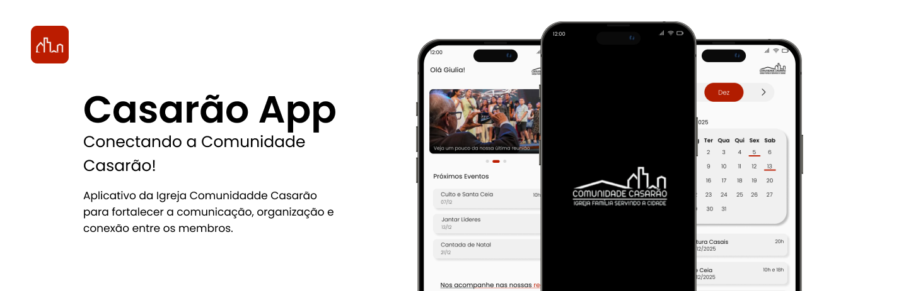

  

 

Este projeto nasceu com o propósito de conectar e facilitar o dia a dia da nossa comunidade. Nosso objetivo é centralizar tudo o que você precisa em um só lugar, trazendo as informações para a palma da sua mão de forma simples, rápida e muito intuitiva.

##  O que você encontra por aqui?

Nosso aplicativo foi carinhosamente pensado para atender às principais necessidades da comunidade. Veja o que preparamos:

  
  <b>Agenda e Eventos</b> 
  Fique por dentro de tudo o que vai acontecer. Acompanhe nosso calendário e não perca nenhum encontro importante.

 

  
  <b>Galeria de Fotos</b> 
  Reviva os melhores momentos da comunidade com um mural especial de lembranças.

 

  
  <b>Cursos</b> 
  Um espaço dedicado ao aprendizado e crescimento com acesso prático às informações.

 

  
  <b>Perfil Personalizado</b> 
  Gerencie suas informações e personalize sua experiência no app.

 

  
  <b>Canal de Solicitações</b> 
  Um canal direto para dúvidas, ajuda ou pedidos.

##  Nosso Propósito

O **Comunidade Casarão** é muito mais do que um aplicativo; é uma ferramenta para aproximar pessoas. Queremos que cada membro se sinta parte ativa da nossa história, com acesso imediato à informação e muita facilidade para interagir com o que a comunidade tem de melhor.

 

  

 

  

